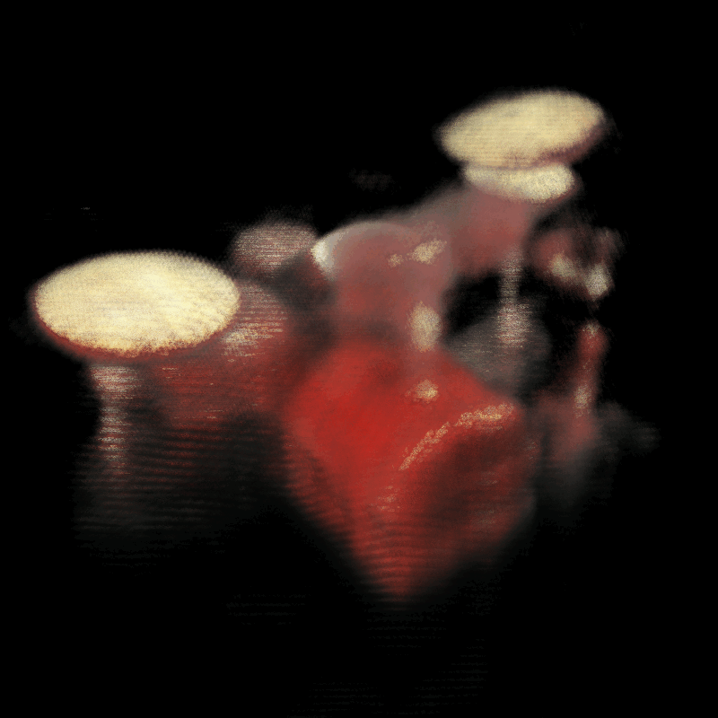

# NeRF

---
Re-implementation of ECCV 2020 NeRF with PyTorch:

- [Representing Scenes as Neural Radiance Fields for View Synthesis](https://www.matthewtancik.com/nerf)
- 能训练出来真是太舒服啦

Quick overview for a 10-hour training results (single view rendering, APEX O2 optimized) in nerf-blender-synthetic dataset (drums):



This repo contains:

- CUDA implemented functions, like inverse transform sampling, image sampler, positional encoding module, etc.
- A simpler version (in terms of readability) of NeRF (comparing with offcial NeRF implementation which is written in TensorFlow)
- Simple APEX accelerated version of NeRF 

---

## Requirements

- To enable APEX auto mixed precision, you need [NVIDIA/apex](https://github.com/NVIDIA/apex), just follow the instruction of apex and you are good to go. APEX support is disabled by default. You would need to set `-s` or `--scale` when running the `train.py`
- To test CUDA implementation, make sure:
  - Libtorch has the correspond version (the same as your CUDA version)
  - The CUDA version of PyTorch should be the same as that of CUDA 
  - `libeigen3-dev` is required. However, for Ubuntu 18.04 users, the default version of `libeigen3-dev`in apt is 3.3.4, which is too low for CUDA 11+, when compiling, an error might be thrown ("<math_functions.hpp> not found"). To correctly compile CUDA extensions, you would need to download Eigen 3.4.0 and compile it manually. After installing Eigen 3.4.0, `setup.py` in `cuda/` should be modified if the `CMAKE_INSTALL_PREFIX` is not `/usr/local/include`
- Other requirements

| PyTorch          | torchvision                         | argparse        | tensorboard | numpy/PIL | scipy    |
| ---------------- | ----------------------------------- | --------------- | ----------- | --------- | -------- |
| 1.7+ recommended | (depends on the version of PyTorch) | 1.1 recommended | 1.15+       | ...       | optional |

---

## Repo Structure

```
.
├── logs/ --- tensorboard log storage (compulsory)
├── model/ --- folder from and to which the models are loaded & stored (compulsory)
├── check_points/ --- check_points folder (compulsory)
├── train.py --- Python main module
├── test --- quick testing script
	 ├── ...
├── cuda
	 ├── src
	 		├── ... (cuda implemented functions)
	 └── setup.py	--- PyTorch CUDA extension compiling and exporting script
└── py/ 
	 ├── configs.py  --- For tiny-cuda-nn: fatser neural network implementation, the config files
	 ├── dataset.py --- Custom dataset for loading nerf-synthetic dataset
	 ├── model.py --- NeRF model, main. (include model definition and rendering)
	 ├── timer.py --- TicToc timer.
	 └── utils.py --- Some utility functions
```

---

## Compile & Run

### I. With CUDA extension

To build pytorch extension for python. Run:

```shell
cd cuda/
python ./setup.py install --user
```

There is probably a compilation error, which might be caused by include directory specified in `setup.py`.  Note that:

- If you are using arch_70+, (for example, I am using RTX 3060 whose architect is sm_86), eigen 3.3.7 or higher is required. Otherwise you will get an error `No such file or directory <math_functions.h>`. I'm using the manually installed Eigen 3.4.0, which is located in `/usr/local/include/eigen3`
- If the GPU architecture is lower than arch_70, normal `libeigen3_dev` (version 3.3.4 on Ubuntu 18.04) will suffice. 

Actually, CUDA extension is not well supported after debugging (positional encoding can still be used, the script for running all other functions are largely changed, yet they are all tested previously, should work fine.), and **<u>it is not compatible with APEX or other auto mixed precision libs (like torch.amp)</u>**

### II. Run, directly

直接，润。那么应该怎么润呢？

To run the training, make sure you have `output/` and `check_points/` folder in the `root` dir, otherwise I will throw u an error, then:

```
cd . 		# cd 2 root dir
python ./train.py -s 		# -s enables apex O2 optimization, which is 40%-50% faster during training
```

For other configurations, plz refer to `python ./train.py --help` for more help.

---

## Results

Apart from the dynamic results (full resolution) listed above, there are some additional results (from nerf-blender-synthetic dataset (lego)):

Iterated for 20 epochs (100 images selected, which takes 260s to train, 13s per epoch on RTX 3060)


Iterated for ?? epochs (I don't remember). The top-left-most image is rendered by coarse network, therefore it is more blurred.


Iterated for 100s epochs (3+ hours - training, apex O2, half resolution, (rendering is slow, 42s for eight images)). The top-left-most image is rendered by coarse network, therefore it is more blurred.


I am not so patient, therefore all of the models aren't trained thoroughly (also I think it is meaningless to do that). 
