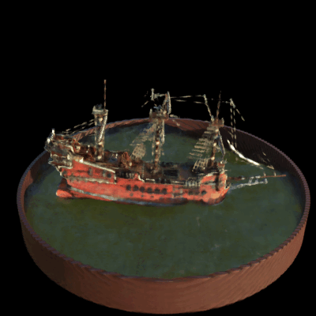
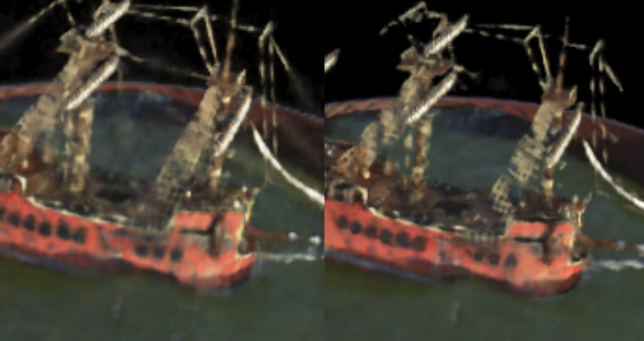
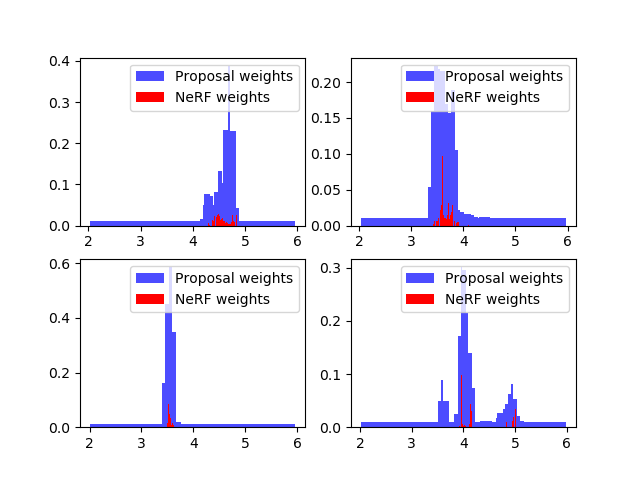
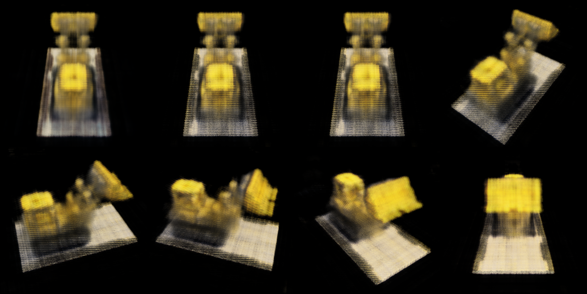
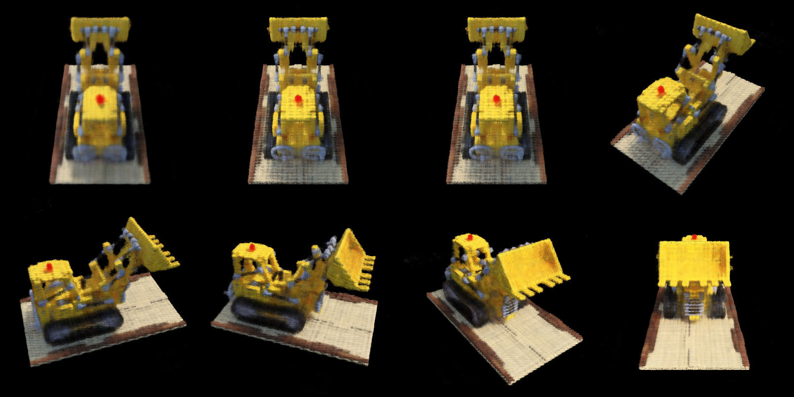
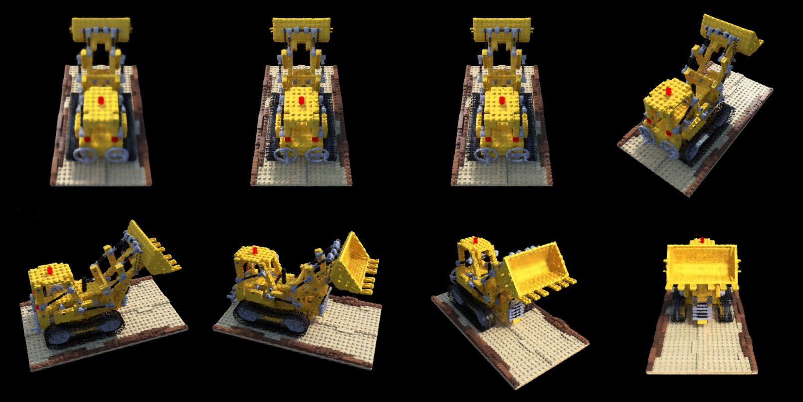

# NeRFs

---
(README Update 2023.8.18): Note that this repo is a little bit old, the backbone and main logics are implemented last year. For (much) better integrated project, I recommend [nerfstudio](https://github.com/nerfstudio-project/nerfstudio). You can also check our competition results out in [nerfstudio-giga](https://github.com/Enigmatisms/nerfstudio-giga).

This repo contains the following reproduction implementation:

(1) CVPR 2022 best student honorable mention: [Ref-NeRF: Structured View-Dependent Appearance for Neural Radiance Fields](https://arxiv.org/abs/2112.03907) is implemented in this repo. This repo can turn Ref NeRF part on/off with one flag: `-t`. Ref NeRF is implemented upon (proposal network + NeRF) framework. Currently, the result is not so satisfying as I expected. This may be caused by insufficient time for training (limited training device, 6GB global memory, can only use up to batch size 2^9 (rays), while the paper uses 2^14).

(2) The idea from [ICCV 2021: Mip-NeRF: A Multiscale Representation for Anti-Aliasing Neural Radiance Fields](https://jonbarron.info/mipnerf/), using conical frustum instead of pure points in sampling, trying to solve the problem of aliasing under multi-resolution settings. Removed the use of coarse network.

(3) The idea from [CVPR 2022: Mip-NeRF 360: Unbounded Anti-Aliased Neural Radiance Fields](https://paperswithcode.com/paper/mip-nerf-360-unbounded-anti-aliased-neural/review/), which currently has no open-sourced code.

(4) Original NeRF paper: [ECCV 2020: Representing Scenes as Neural Radiance Fields for View Synthesis](https://www.matthewtancik.com/nerf). Well, actually this is lost in all these commits.

(5) Info-NeRF (information theory based regularizer, boosting results for "few shot" learning in NeRF): [InfoNeRF: Ray Entropy Minimization for Few-Shot Neural Volume Rendering](https://arxiv.org/abs/2112.15399). The reproduction is implemented by [Dinngger](https://github.com/Dinngger), in branch `infonerf`.

- Using shallower proposal network distilled from NeRF MLP weight rendering, in order to reduce the evaluation time for coarse samples.
- Ref NeRF is built together with the proposal network proposed in mip NeRF 360, making the model harder to train. The reason behind this is (I suppose) normal prediction in Ref NeRF uses a "back-culling strategy" (orientation loss), which prevents foggy artifacts behind semi-transparent surface. This strategy will both concentrate density and have some strange (magical) effect on the gradients of proposal network. I experimented with original NeRF framework, and things seem to work out fine, with no mosaic-like noise.
- Using weight regularizer which aims to concentrate computed weight in a smaller region, make it more "delta-function-like". The final output is more accurate. There are some results and a small comparison below.

If you are interested in the implementation of NeRFs and you don't want to read tedious codes, then this repo offers more comprehensive codes (Yeah, clearer logic, but not necessarily good-looking or efficient or even scalable..., it depends on how u see things). For more detailed info about this repo and reproduction, please refer to:

- [Updates.md](https://github.com/Enigmatisms/NeRF/blob/master/Update.md). This file records the major updates of this repo.
- Some Chinese blogs of mine: [Neural Randiance Field【1】](https://enigmatisms.github.io/2022/03/13/Neural-Randiance-Field%E3%80%901%E3%80%91/)，[NeRF论文复现](https://enigmatisms.github.io/2022/03/27/NeRF%E8%AE%BA%E6%96%87%E5%A4%8D%E7%8E%B0/)， [Ref NeRF复现](https://enigmatisms.github.io/2022/08/13/Mip-NeRF-Ref-NeRF/)
- If you are interested in CUDA implementations (there were, once), please refer to: [issue#4](https://github.com/Enigmatisms/NeRF/issues/4) and [issue#6](https://github.com/Enigmatisms/NeRF/issues/6) 

Some Ref NeRF results:
(Latest-commit `e4907564`) Shinny blender "helmet" dataset trained for 3 hours (not completed, PSNR around 27). Oops, gif file to big to upload. Fine, just imagine the output, its better than the older commit (in terms of normal prediction)

(Older-commit `847fdb9d`) Shinny blender "helmet" dataset trained for 6-7 hours (not completed, PSNR around 28.5.)


Some old results(2022.6) : Mip NeRF proposal network distillation with amp speed up (yeah, this is faster)

|                    Lego trained for 2.5h                     |                   Hotdog trained for 30min                   |
| :----------------------------------------------------------: | :----------------------------------------------------------: |
|  |  |

Some older results (2022.4): 

|   Spherical views (400 * 400)    |          Comparison (no regularizer - left)           |   Proposal network distillation   |
| :------------------------------: | :---------------------------------------------------: | :-------------------------------: |
|  |  |  |


---

## Side Notes

This repo contains:

- CUDA implemented functions, like inverse transform sampling, image sampler, positional encoding module, etc.
- A simpler version (in terms of readability) of NeRF (comparing with offcial NeRF implementation which is written in TensorFlow)
- Simple APEX accelerated version of NeRF 

---

## Requirements

- To enable APEX auto mixed precision, you need [NVIDIA/apex](https://github.com/NVIDIA/apex), just follow the instruction of apex and you are good to go. APEX support is disabled by default. You would need to set `-s` or `--scale` when running the `train.py`
- To test CUDA implementation, make sure:
  - Libtorch has the correspond version (the same as your CUDA version)
  - The CUDA version of PyTorch should be the same as that of CUDA 
  - `libeigen3-dev` is required. However, for Ubuntu 18.04 users, the default version of `libeigen3-dev`in apt is 3.3.4, which is too low for CUDA 11+, when compiling, an error might be thrown ("<math_functions.hpp> not found"). To correctly compile CUDA extensions, you would need to download Eigen 3.4.0 and compile it manually. After installing Eigen 3.4.0, `setup.py` in `cuda/` should be modified if the `CMAKE_INSTALL_PREFIX` is not `/usr/local/include`
- Other requirements

| PyTorch          | torchvision                         | argparse        | tensorboard | numpy/PIL | scipy    |
| ---------------- | ----------------------------------- | --------------- | ----------- | --------- | -------- |
| 1.7+ recommended | (depends on the version of PyTorch) | 1.1 recommended | 1.15+       | ...       | optional |

---

## Repo Structure

There are some folders **YOU MUST HAVE** in the root folder! (See below, the compulsory ones, which is not included in this cloud repo (git ignored))

```
.
├── logs/ --- tensorboard log storage (compulsory)
├── model/ --- folder from and to which the models are loaded & stored (compulsory)
├── check_points/ --- check_points folder (compulsory)
├── train.py --- Python main module
├── test --- quick testing script
	 ├── ...
├── cuda
	 ├── src
	 		├── ... (cuda implemented functions)
	 └── setup.py	--- PyTorch CUDA extension compiling and exporting script
└── py/ 
	 ├── addtional.py  --- For mip nerf (proposal network and regularizer)
	 ├── mip_methods.py  --- Though current implementation uses no cone samling (mip part), the mip functions are retained.
	 ├── mip_model.py  --- Mip NeRF (no ref), or rather say: NeRF model definition
	 ├── nerf_base.py  --- Both Ref NeRF and Mip NeRF inherited from this base class
	 ├── procedures.py  --- Functions like rendering a whole image, rendering with orbital camera views, **argparse default settings**
	 ├── ref_func.py  --- Ref NeRF spherical harmonics (modified and adopted from Ref NeRF official repo)
	 ├── ref_model.py  --- Ref NeRF model definition
	 ├── dataset.py --- Custom dataset for loading nerf-synthetic dataset
	 ├── model.py --- NeRF model, main. (include model definition and rendering)
	 ├── timer.py --- TicToc timer.
	 └── utils.py --- Some utility functions
```

---

## Compile & Run

### I. With CUDA extension (Deprecated)

CUDA extension is no longer in use for a long time (Dozens of commits ago). But if u insists...

To build pytorch extension for python. Run:

```shell
cd cuda/
python ./setup.py install --user
```

There is probably a compilation error, which might be caused by include directory specified in `setup.py`.  Note that:

- If you are using arch_70+, (for example, I am using RTX 3060 whose architect is sm_86), eigen 3.3.7 or higher is required. Otherwise you will get an error `No such file or directory <math_functions.h>`. I'm using the manually installed Eigen 3.4.0, which is located in `/usr/local/include/eigen3`
- If the GPU architecture is lower than arch_70, normal `libeigen3_dev` (version 3.3.4 on Ubuntu 18.04) will suffice. 

Actually, CUDA extension is not well supported after debugging (positional encoding can still be used, the script for running all other functions are largely changed, yet they are all tested previously, should work fine.), and **<u>it is not compatible with APEX or other auto mixed precision libs (like torch.amp)</u>**

### II. Run, directly

直接，润。那么应该怎么润呢？

To run the training, make sure you have `output/` and `check_points/` folder in the `root` dir, otherwise I will throw u an error, then:

```
cd . 		# cd 2 root dir
python ./train.py -s 		# -s enables apex O1 optimization, which is 30%-40% faster during training
```

For other configurations, plz refer to `python ./train.py --help` for more help.

---

## Results (Outdated)

Please just refer to the "demo" part.

Apart from the dynamic results (full resolution) listed above, there are some additional results (from nerf-blender-synthetic dataset (lego)):

Iterated for 20 epochs (100 images selected, which takes 260s to train, 13s per epoch on RTX 3060)



Iterated for ?? epochs (I don't remember). The top-left-most image is rendered by coarse network, therefore it is more blurred.



Iterated for 100s epochs (3+ hours - training, apex O2, half resolution, (rendering is slow, 42s for eight images)). The top-left-most image is rendered by coarse network, therefore it is more blurred.



I am not so patient, therefore all of the models aren't trained thoroughly (also I think it is meaningless to do that). 
